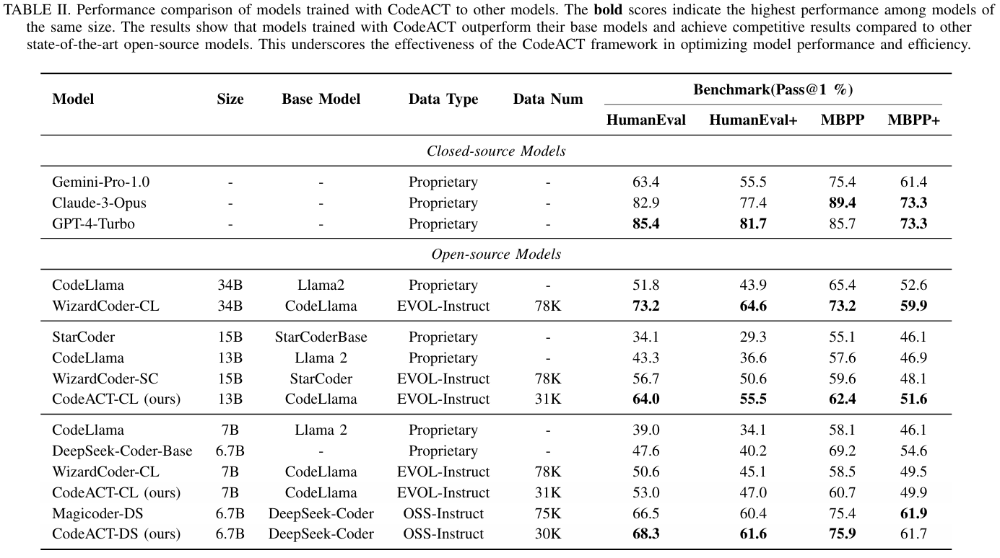

# CodeACT: Code Adaptive Compute-efficient Tuning Framework for Code LLMs

[](https://arxiv.org/abs/2408.02193)

> We are planning to unveil the codes soon.

## Overview

Motivated by the need for more effective and efficient training, we propose the **Code** **A**daptive **C**ompute-efficient **T**uning (**CodeACT**) framework. CodeACT introduces the **C**omplexity and **D**iversity **A**ware **S**ampling (**CDAS**) method to select high-quality training data based on complexity and diversity, and the **Dynamic Pack** padding strategy to reduce computational resource usage by minimizing padding tokens during training. 

Experimental results demonstrate that ***CodeACT-DeepSeek-Coder-6.7B***, fine-tuned on only 40% of the EVOL-Instruct data, achieves an 8.6\% performance increase on HumanEval, reduces training time by 78%, and decreases peak GPU memory usage by 27%. 

## Components

### Complexity and Diversity Aware Sampling

<div style="text-align: center;">

</div>

An overview of our proposed CDAS method, including three steps from top to bottom. 

* Step 1: Clustering the EVOL-Instruct dataset to form multiple clusters. 
* Step 2: Computing the Instruction-Following Difficulty score by comparing the model's perplexity with and without instructions. 
* Step 3: Sampling the top m\% instances from each re-ranked cluster to form a high-complexity sub-dataset that preserves data diversity. 

Finally, we use the selected data for fine-tuning to obtain CodeACT-Coder.

### Dynamic Pack

<div style="text-align: center;">

</div>

Illustration of different padding strategies, where the blank squares represent padding tokens. 
* Top: Traditional padding strategy aligns samples to the model's maximum input length, resulting in high computational resource consumption. 
* Middle: Dynamic padding strategy reduces the number of padding tokens by aligning samples to the length of the longest sample in each batch. 
* Bottom: Our proposed Dynamic Pack strategy sorts samples by length and concatenates multiple samples within a batch, further optimizing the utilization of the model's maximum input length and reducing padding tokens.

## Results

### RQ1: How does the CodeACT framework perform across different datasets and models?


The CodeACT framework has been tested for its performance and efficiency on the OSS-Instruct and EVOL-Instruct datasets using the CodeLlama and DeepSeek-Coder models. The results show that CodeACT effectively optimizes computational resources while maintaining or improving model performance, highlighting its potential for efficient and effective model training.

<div style="text-align: center;">

</div>

### RQ2: How does the performance of models trained with CodeACT compare to other models?

The open-source models trained with CodeACT show significant performance improvements. Notably, CodeACT-DS-6.7B, trained on fewer data samples, surpasses models trained on larger datasets, showcasing the effectiveness of the CDAS method for data selection. These results indicate that CodeACT not only enhances model performance but also bridges the gap between open-source and closed-source models, positioning it as a valuable tool for advancing the capabilities of Code LLMs with optimized data selection and training processes.

<div style="text-align: center;">

</div>

## Citation

If you find CodeACT helpful, please cite it as follows:

```bibtex
@misc{lv2024codeactcodeadaptivecomputeefficient,
      title={CodeACT: Code Adaptive Compute-efficient Tuning Framework for Code LLMs}, 
      author={Weijie Lv and Xuan Xia and Sheng-Jun Huang},
      year={2024},
      eprint={2408.02193},
      archivePrefix={arXiv},
      primaryClass={cs.CL},
      url={https://arxiv.org/abs/2408.02193}, 
}
```
